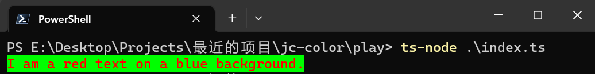
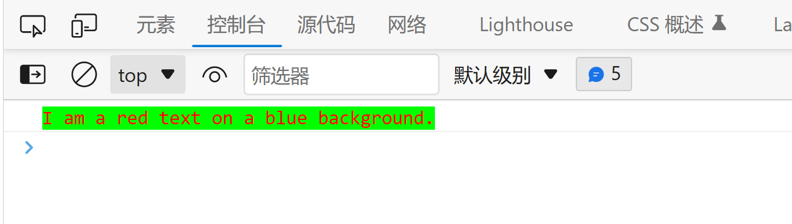

# jc-color

[中文](readme_CN.md) | English

**Author**: Jack Lee (李俊才)

**Author Email**: [291148484@163.com](mailto:291148484@163.com)

**github**: https://github.com/jacklee1995/jc-color

A color tool, which can be used for **color type conversion**, **color matching** and **console output**. It can be used not only in **browsers**, but also in **NodeJS**.

## 1. Install

### use npm to install

```shell
npm install jc-color
```

### use yarn to install

```shell
yarn add jc-color
```

### use pnpm to install

```shell
pnpm install jc-color
```

## 2. Some concepts of color

In daily life, human eyes see that the different colors of an object come from the selective absorption of light by the object. When an object does not absorb a certain wavelength of light, this light wave will be reversed by the object and enter people's eyes. Non-luminous objects in life let us perceive color by reflecting light that we don't absorb, but for luminous objects such as display devices, on the contrary, they let us perceive color by emitting light with a specific wavelength. Any color in optics is formed by the superposition of three basic colors, which are called the * * three primary colors of light. Various colors, including white, can be obtained by the superposition of the three primary colors of light. These three primary colors include ** red **Red**, **Green** and **Blue**.

## 3. Representation method of color

### 3.1 Use RGB to represent colors

### 3.2 Use hexadecimal number to represent colors

## 4. handle of color

## 5. Use colored text on the console.

### 5.1 Object ColorUnit

Object `ColorUnit` is the constituent particle of the console color text. You can create a color text unit by giving RGB value objects of foreground color and background color.

```ts
import { TextUnit } from 'jc-color'

const text = "I am a red text on a blue background."; // Text to be printed on the console.
const foreColor = {red:255,green:0,blue:0};           // Text color
const bgColor = {red:0,green:255,blue:0};             // Background color

const unit = new TextUnit(text, foreColor, bgColor)
unit.print();
```

这段代码 NodeJS 环境的终端中的运行效果看起来是这样子的：



The same code can also be perfectly applied to the console of the browser, and the effect looks like this:




---

# Appendix. Internally defined color names

For the convenience of use, `jc-color` has predefined some common color names. These color names are generally consistent with the colors defined in CSS standards. The color names and corresponding values are as follows:

| color names | hex color value | Effect preview |  | color names | hex color value | Effect preview |
| :-  | :- | :- | :-  | :- | :- | :- |
| black | #000000 | <table><td bgcolor="#000000">#000000</td></table> || navy | #000080 | <table><td bgcolor="#000080">#000080</td></table> |
| darkblue | #00008B | <table><td bgcolor="#00008B">#00008B</td></table> || mediumblue | #0000CD | <table><td bgcolor="#0000CD">#0000CD</td></table> |
| blue | #0000FF | <table><td bgcolor="#0000FF">#0000FF</td></table> || darkgreen | #006400 | <table><td bgcolor="#006400">#006400</td></table> |
| green | #008000 | <table><td bgcolor="#008000">#008000</td></table> || teal | #008080 | <table><td bgcolor="#008080">#008080</td></table> |
| darkcyan | #008B8B | <table><td bgcolor="#008B8B">#008B8B</td></table> || deepskyblue | #00BFFF | <table><td bgcolor="#00BFFF">#00BFFF</td></table> |
| darkturquoise | #00CED1 | <table><td bgcolor="#00CED1">#00CED1</td></table> || mediumspringgreen | #00FA9A | <table><td bgcolor="#00FA9A">#00FA9A</td></table> |
| lime | #00FF00 | <table><td bgcolor="#00FF00">#00FF00</td></table> || springgreen | #00FF7F | <table><td bgcolor="#00FF7F">#00FF7F</td></table> |
| aqua | #00FFFF | <table><td bgcolor="#00FFFF">#00FFFF</td></table> || cyan | #00FFFF | <table><td bgcolor="#00FFFF">#00FFFF</td></table> |
| midnightblue | #191970 | <table><td bgcolor="#191970">#191970</td></table> || dodgerblue | #1E90FF | <table><td bgcolor="#1E90FF">#1E90FF</td></table> |
| lightseagreen | #20B2AA | <table><td bgcolor="#20B2AA">#20B2AA</td></table> || forestgreen | #228B22 | <table><td bgcolor="#228B22">#228B22</td></table> |
| seagreen | #2E8B57 | <table><td bgcolor="#2E8B57">#2E8B57</td></table> || darkslategray | #2F4F4F | <table><td bgcolor="#2F4F4F">#2F4F4F</td></table> |
| limegreen | #32CD32 | <table><td bgcolor="#32CD32">#32CD32</td></table> || mediumseagreen | #3CB371 | <table><td bgcolor="#3CB371">#3CB371</td></table> |
| turquoise | #40E0D0 | <table><td bgcolor="#40E0D0">#40E0D0</td></table> || royalblue | #4169E1 | <table><td bgcolor="#4169E1">#4169E1</td></table> |
| steelblue | #4682B4 | <table><td bgcolor="#4682B4">#4682B4</td></table> || mediumturquoise | #48D1CC | <table><td bgcolor="#48D1CC">#48D1CC</td></table> |
| darkslateblue | #483D8B | <table><td bgcolor="#483D8B">#483D8B</td></table> ||indigo | #4B0082 | <table><td bgcolor="#4B0082">#4B0082</td></table> |
| darkolivegreen | #556B2F | <table><td bgcolor="#556B2F">#556B2F</td></table> || cadetblue | #5F9EA0 | <table><td bgcolor="#5F9EA0">#5F9EA0</td></table> |
| cornflowerblue | #6495ED | <table><td bgcolor="#6495ED">#6495ED</td></table> || mediumaquamarine | #66CDAA | <table><td bgcolor="#66CDAA">#66CDAA</td></table> |
| dimgray | #696969 | <table><td bgcolor="#696969">#696969</td></table> ||slateblue | #6A5ACD | <table><td bgcolor="#6A5ACD">#6A5ACD</td></table> |
| olivedrab | #6B8E23 | <table><td bgcolor="#6B8E23">#6B8E23</td></table> ||slategray | #708090 | <table><td bgcolor="#708090">#708090</td></table> |
| lightslategray | #778899 | <table><td bgcolor="#778899">#778899</td></table> || mediumslateblue | #7B68EE | <table><td bgcolor="#7B68EE">#7B68EE</td></table> |
| lawngreen | #7CFC00 | <table><td bgcolor="#7CFC00">#7CFC00</td></table> ||chartreuse | #7FFF00 | <table><td bgcolor="#7FFF00">#7FFF00</td></table> |
| aquamarine | #7FFFD4 | <table><td bgcolor="#7FFFD4">#7FFFD4</td></table> ||maroon | #800000 | <table><td bgcolor="#800000">#800000</td></table> |
| purple | #800080 | <table><td bgcolor="#800080">#800080</td></table> ||olive | #808000 | <table><td bgcolor="#808000">#808000</td></table> |
| gray | #808080 | <table><td bgcolor="#808080">#808080</td></table> ||lightskyblue | #87CEFA | <table><td bgcolor="#87CEFA">#87CEFA</td></table> |
| skyblue | #87CEEB | <table><td bgcolor="#87CEEB">#87CEEB</td></table> ||blueviolet | #8A2BE2 | <table><td bgcolor="#8A2BE2">#8A2BE2</td></table> |
| darkred | #8B0000 | <table><td bgcolor="#8B0000">#8B0000</td></table> ||darkmagenta | #8B008B | <table><td bgcolor="#8B008B">#8B008B</td></table> |
| saddlebrown | #8B4513 | <table><td bgcolor="#8B4513">#8B4513</td></table> ||darkseagreen | #8FBC8F | <table><td bgcolor="#8FBC8F">#8FBC8F</td></table> |
| lightgreen | #90EE90 | <table><td bgcolor="#90EE90">#90EE90</td></table> ||mediumpurple | #9370DB | <table><td bgcolor="#9370DB">#9370DB</td></table> |
| darkviolet | #9400D3 | <table><td bgcolor="#9400D3">#9400D3</td></table> ||palegreen | #98FB98 | <table><td bgcolor="#98FB98">#98FB98</td></table> |
| darkorchid | #9932CC | <table><td bgcolor="#9932CC">#9932CC</td></table> ||yellowgreen | #9ACD32 | <table><td bgcolor="#9ACD32">#9ACD32</td></table> |
| sienna | #A0522D | <table><td bgcolor="#A0522D">#A0522D</td></table> ||brown | #A52A2A | <table><td bgcolor="#A52A2A">#A52A2A</td></table> |
| darkgray | #A9A9A9 | <table><td bgcolor="#A9A9A9">#A9A9A9</td></table> ||lightblue | #ADD8E6 | <table><td bgcolor="#ADD8E6">#ADD8E6</td></table> |
| greenyellow | #ADFF2F | <table><td bgcolor="#ADFF2F">#ADFF2F</td></table> ||paleturquoise | #AFEEEE | <table><td bgcolor="#AFEEEE">#AFEEEE</td></table> |
| lightsteelblue | #B0C4DE | <table><td bgcolor="#B0C4DE">#B0C4DE</td></table> ||firebrick | #B22222 | <table><td bgcolor="#B22222">#B22222</td></table> |
| darkgoldenrod | #B8860B | <table><td bgcolor="#B8860B">#B8860B</td></table> || mediumorchid | #BA55D3 | <table><td bgcolor="#BA55D3">#BA55D3</td></table> |
| rosybrown | #BC8F8F | <table><td bgcolor="#BC8F8F">#BC8F8F</td></table> ||darkkhaki | #BDB76B | <table><td bgcolor="#BDB76B">#BDB76B</td></table> |
| indianred | #CD5C5C | <table><td bgcolor="#CD5C5C">#CD5C5C</td></table> ||goldenrod | #DAA520 | <table><td bgcolor="#DAA520">#DAA520</td></table> |
| palevioletred | #DB7093 | <table><td bgcolor="#DB7093">#DB7093</td></table> ||crimson | #DC143C | <table><td bgcolor="#DC143C">#DC143C</td></table> |
| lavender | #E6E6FA | <table><td bgcolor="#E6E6FA">#E6E6FA</td></table> ||darksalmon | #E9967A | <table><td bgcolor="#E9967A">#E9967A</td></table> |
| palegoldenrod | #EEE8AA | <table><td bgcolor="#EEE8AA">#EEE8AA</td></table> ||lightcoral | #F08080 | <table><td bgcolor="#F08080">#F08080</td></table> |
| aliceblue | #F0F8FF | <table><td bgcolor="#F0F8FF">#F0F8FF</td></table> || honeydew | #F0FFF0 | <table><td bgcolor="#F0FFF0">#F0FFF0</td></table> |
| wheat | #F5DEB3 | <table><td bgcolor="#F5DEB3">#F5DEB3</td></table> || deeppink | #FF1493 | <table><td bgcolor="#FF1493">#FF1493</td></table> |
| darkorange | #FF8C00 | <table><td bgcolor="#FF8C00">#FF8C00</td></table> || gold | #FFD700 | <table><td bgcolor="#FFD700">#FFD700</td></table> |
| peachpuff | #FFDAB9 | <table><td bgcolor="#FFDAB9">#FFDAB9</td></table> || papayawhip | #FFEFD5 | <table><td bgcolor="#FFEFD5">#FFEFD5</td></table> |
| powderblue | #B0E0E6 | <table><td bgcolor="#B0E0E6">#B0E0E6</td></table> || chocolate | #D2691E | <table><td bgcolor="#D2691E">#D2691E</td></table> |
| tan | #D2B48C | <table><td bgcolor="#D2B48C">#D2B48C</td></table> || lightgray | #D3D3D3 | <table><td bgcolor="#D3D3D3">#D3D3D3</td></table> |
| silver | #C0C0C0 | <table><td bgcolor="#C0C0C0">#C0C0C0</td></table> || mediumvioletred | #C71585 | <table><td bgcolor="#C71585">#C71585</td></table> |
| fuchsia | #C83293 | <table><td bgcolor="#C83293">#C83293</td></table> ||peru | #CD853F | <table><td bgcolor="#CD853F">#CD853F</td></table> |
| thistle | #D8BFD8 | <table><td bgcolor="#D8BFD8">#D8BFD8</td></table> ||orchid | #DA70D6 | <table><td bgcolor="#DA70D6">#DA70D6</td></table> |
| gainsboro | #DCDCDC | <table><td bgcolor="#DCDCDC">#DCDCDC</td></table> ||plum | #DDA0DD | <table><td bgcolor="#DDA0DD">#DDA0DD</td></table> |
| burlywood | #DEB887 | <table><td bgcolor="#DEB887">#DEB887</td></table> || lightcyan | #E0FFFF | <table><td bgcolor="#E0FFFF">#E0FFFF</td></table> |
| violet | #EE82EE | <table><td bgcolor="#EE82EE">#EE82EE</td></table> ||khaki | #F0E68C | <table><td bgcolor="#F0E68C">#F0E68C</td></table> |
| azure | #F0FFFF | <table><td bgcolor="#F0FFFF">#F0FFFF</td></table> ||beige | #F5F5DC | <table><td bgcolor="#F5F5DC">#F5F5DC</td></table> |
| whitesmoke | #F5F5F5 | <table><td bgcolor="#F5F5F5">#F5F5F5</td></table> ||mintcream | #F5FFFA | <table><td bgcolor="#F5FFFA">#F5FFFA</td></table> |
| ghostwhite | #F8F8FF | <table><td bgcolor="#F8F8FF">#F8F8FF</td></table> ||salmon | #FA8072 | <table><td bgcolor="#FA8072">#FA8072</td></table> |
| sandybrown | #FAA460 | <table><td bgcolor="#FAA460">#FAA460</td></table> ||antiquewhite | #FAEBD7 | <table><td bgcolor="#FAEBD7">#FAEBD7</td></table> |
| linen | #FAF0E6 | <table><td bgcolor="#FAF0E6">#FAF0E6</td></table> || lightgoldenrodyellow | #FAFAD2 | <table><td bgcolor="#FAFAD2">#FAFAD2</td></table> |
| oldlace | #FDF5E6 | <table><td bgcolor="#FDF5E6">#FDF5E6</td></table> || red | #FF0000 | <table><td bgcolor="#FF0000">#FF0000</td></table> |
| magenta | #FF00FF | <table><td bgcolor="#FF00FF">#FF00FF</td></table> ||orangered | #FF4500 | <table><td bgcolor="#FF4500">#FF4500</td></table> |
| tomato | #FF6347 | <table><td bgcolor="#FF6347">#FF6347</td></table> || hotpink | #FF69B4 | <table><td bgcolor="#FF69B4">#FF69B4</td></table> |
| coral | #FF7F50 | <table><td bgcolor="#FF7F50">#FF7F50</td></table> ||lightsalmon | #FFA07A | <table><td bgcolor="#FFA07A">#FFA07A</td></table> |
| orange | #FFA500 | <table><td bgcolor="#FFA500">#FFA500</td></table> || lightpink | #FFB6C1 | <table><td bgcolor="#FFB6C1">#FFB6C1</td></table> |
| pink | #FFC0CB | <table><td bgcolor="#FFC0CB">#FFC0CB</td></table> || navajowhite | #FFDEAD | <table><td bgcolor="#FFDEAD">#FFDEAD</td></table> |
| moccasin | #FFE4B5 | <table><td bgcolor="#FFE4B5">#FFE4B5</td></table> || bisque | #FFE4C4 | <table><td bgcolor="#FFE4C4">#FFE4C4</td></table> |
| mistyrose | #FFE4E1 | <table><td bgcolor="#FFE4E1">#FFE4E1</td></table> || blanchedalmond | #FFEBCD | <table><td bgcolor="#FFEBCD">#FFEBCD</td></table> |
| lavenderblush | #FFF0F5 | <table><td bgcolor="#FFF0F5">#FFF0F5</td></table> || seashell | #FFF5EE | <table><td bgcolor="#FFF5EE">#FFF5EE</td></table> |
| cornsilk | #FFF8DC | <table><td bgcolor="#FFF8DC">#FFF8DC</td></table> || lemonchiffon | #FFFACD | <table><td bgcolor="#FFFACD">#FFFACD</td></table> |
| floralwhite | #FFFAF0 | <table><td bgcolor="#FFFAF0">#FFFAF0</td></table> || snow | #FFFAFA | <table><td bgcolor="#FFFAFA">#FFFAFA</td></table> |
| yellow | #FFFF00 | <table><td bgcolor="#FFFF00">#FFFF00</td></table> || lightyellow | #FFFFE0 | <table><td bgcolor="#FFFFE0">#FFFFE0</td></table> |
| ivory | #FFFFF0 | <table><td bgcolor="#FFFFF0">#FFFFF0</td></table> || white | #FFFFFF | <table><td bgcolor="#FFFFFF">#FFFFFF</td></table> |